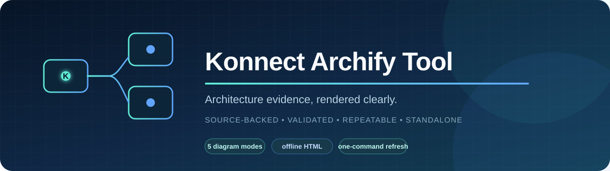

<p align="center">
  
</p>

<h1 align="center">konnect-archify-tool</h1>

<p align="center"><strong>Generate polished, source-backed Konnect architecture diagrams without adding tooling to Konnect.</strong></p>

<p align="center">
  <a href="LICENSE"></a>
  
  
  
</p>

A standalone documentation workspace for producing source-backed diagrams of
[Konnect](https://github.com/neusse/Konnect) without adding Archify or Node.js
to Konnect's runtime, repository, or release packages.

This repository vendors the Archify v2.16.0 Codex skill under
`.agents/skills/archify`. Konnect remains an external, read-only evidence source.

## What belongs here

- Typed Archify JSON specifications under `diagrams/sources/`.
- Validated standalone HTML under `diagrams/output/`.
- Machine-readable validation and visual-check receipts under
  `diagrams/receipts/`.
- Research and adoption notes under `research/`.

This project documents Konnect's software architecture and workflows. It does
not replace KiCad rendering, ERC, DRC, connectivity, layout, or manufacturing
acceptance evidence.

## Requirements

- PowerShell 7+
- Node.js 18+
- A local Konnect checkout

The local Archify runtime has no production npm install step.

## Quick start

Verify the pinned tool:

```powershell
pwsh -File .\scripts\Test-Tool.ps1
```

Validate a diagram against an exact Konnect checkout:

```powershell
pwsh -File .\scripts\Validate-Diagram.ps1 `
  -Type architecture `
  -InputPath .\diagrams\sources\konnect-runtime.architecture.json `
  -KonnectRepo C:\path\to\Konnect
```

Deliver a passing specification:

```powershell
pwsh -File .\scripts\Deliver-Diagram.ps1 `
  -Type architecture `
  -InputPath .\diagrams\sources\konnect-runtime.architecture.json `
  -OutputPath .\diagrams\output\konnect-runtime.html `
  -KonnectRepo C:\path\to\Konnect
```

Refresh the complete stable set from a reviewed Konnect revision:

```powershell
pwsh -File .\.codex\skills\konnect-archify-refresh\scripts\Refresh-KonnectDiagrams.ps1 `
  -ToolRepo . `
  -KonnectRepo C:\path\to\Konnect
```

Install the refresh skill in the current Windows user's Codex skill directory:

```powershell
pwsh -File .\scripts\Install-LocalSkill.ps1
```

See [docs/WORKFLOW.md](docs/WORKFLOW.md) for the evidence and acceptance rules.
See [docs/KONNECT_DIAGRAMS.md](docs/KONNECT_DIAGRAMS.md) for the complete model,
refresh workflow, and Konnect integration boundary.

## Current state

- Published as the standalone
  [`neusse/konnect-archify-tool`](https://github.com/neusse/konnect-archify-tool)
  repository on `main`.
- Archify v2.16.0 copied project-locally and pinned by `skills-lock.json`.
- Archify doctor passes on this workstation.
- Five Konnect specifications cover every Archify diagram mode: architecture,
  workflow, sequence, data flow, and lifecycle.
- Every source passes showcase validation with all nine artifact checks and zero
  composition errors or warnings, and every HTML artifact was produced by a
  successful transactional delivery.
- Browser visual-check passes completely for the runtime architecture. The
  other four artifacts pass capture, readability, and viewer-chrome checks but
  exceed the strict 1440x900 no-scroll viewport. This remains the local release
  blocker; see [diagrams/STATUS.md](diagrams/STATUS.md).
- The repeatable refresh skill is packaged in-repository and can be installed
  locally with `scripts/Install-LocalSkill.ps1`.

## Licensing

Archify retains its MIT license and release metadata under
`.agents/skills/archify/`. The original documentation, scripts, and diagram
sources in this repository are also available under the MIT License.
